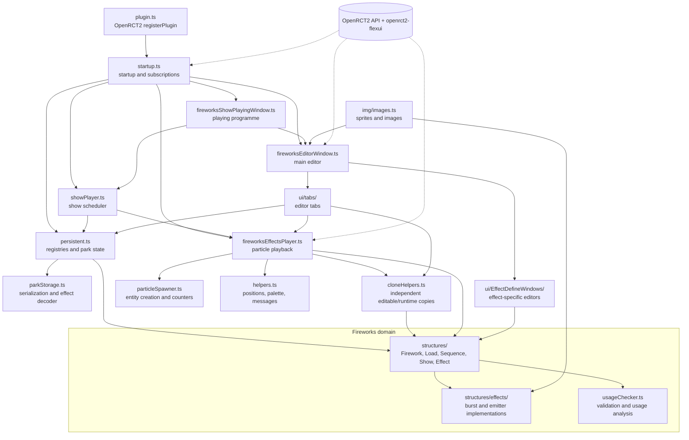
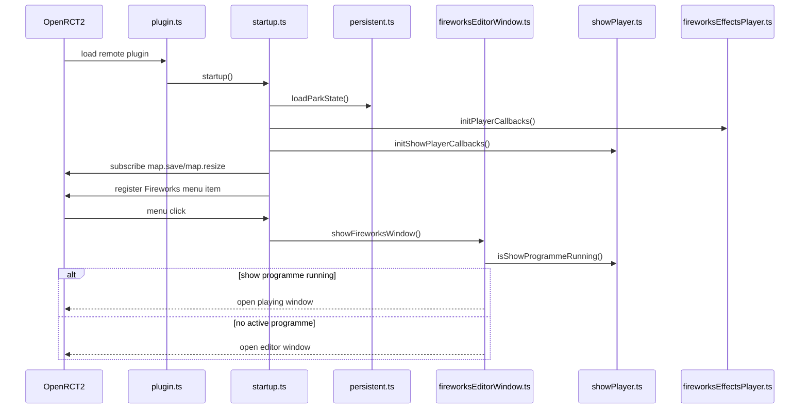
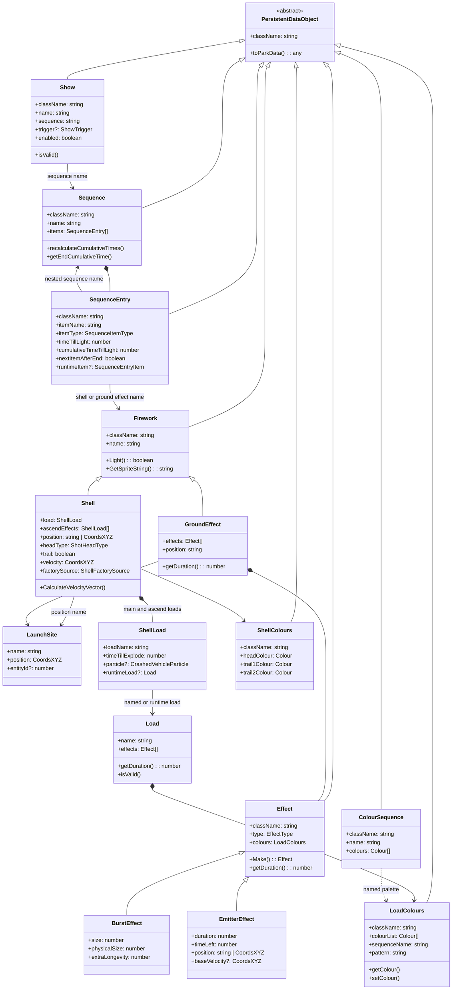
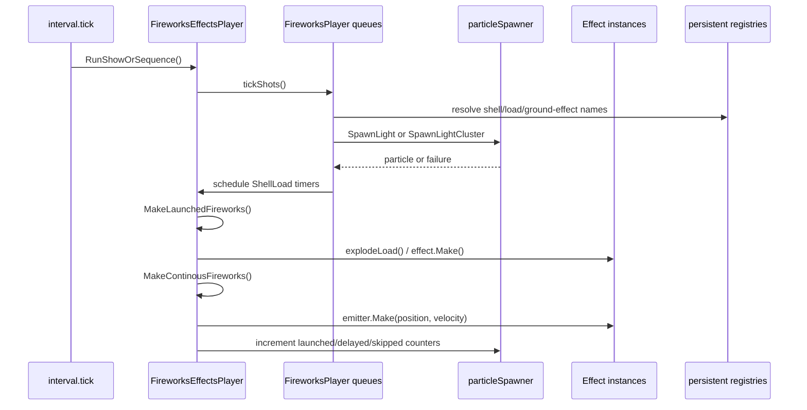
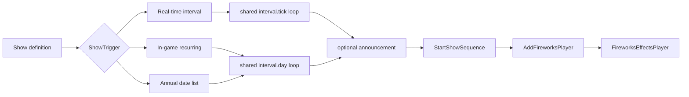
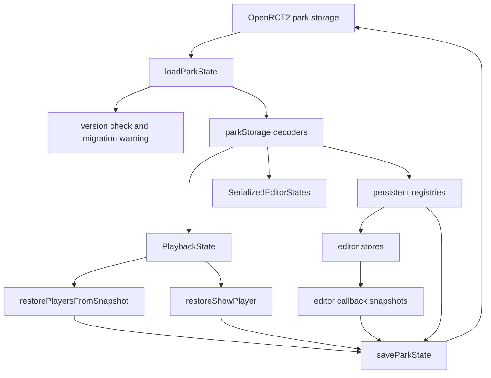
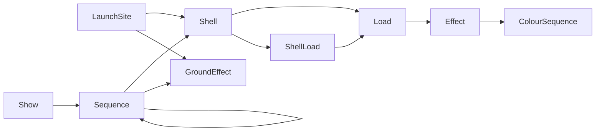
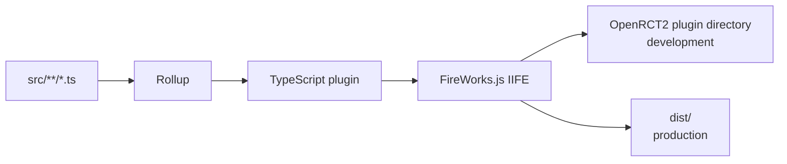

# RCT Fireworks Plugin: Project Architecture

This document describes the authored source for the RCT Fireworks Plugin. It is intended as a map of the project rather than a line-by-line API reference.

## Scope

Included:

- TypeScript source under [`src/`](src/)
- Runtime responsibilities, domain structures, UI surfaces, persistence, and build flow
- Relationships inferred from imports and the implementations in the source tree

Excluded:

- `node_modules/` and all third-party packages
- `tmp-ts/` and `tmp-ts-player/`, which are generated or experimental JavaScript output
- The generated development plugin written to the OpenRCT2 plugin directory
- OpenRCT2 engine APIs and `openrct2-flexui` internals, which are treated as external boundaries

## Project At A Glance

The plugin is an OpenRCT2 remote plugin. Rollup starts at [`src/plugin.ts`](src/plugin.ts), registers metadata and delegates startup to [`src/startup.ts`](src/startup.ts). Startup initializes sprites, restores park state, registers runtime callbacks, subscribes to OpenRCT2 events, and exposes the editor through the OpenRCT2 UI menu.

The authored code has four main layers:

| Layer | Location | Responsibility |
| --- | --- | --- |
| Bootstrap | [`src/plugin.ts`](src/plugin.ts), [`src/startup.ts`](src/startup.ts), [`src/pluginInfo.ts`](src/pluginInfo.ts) | Plugin registration, initialization, menu integration, tutorial entry point |
| Domain and runtime | [`src/fireworks/`](src/fireworks/) | Firework definitions, effects, scheduling, particle spawning, validation, show playback |
| Persistence and integration | [`src/fireworks/persistent.ts`](src/fireworks/persistent.ts), [`src/fireworks/parkStorage.ts`](src/fireworks/parkStorage.ts), [`src/fireworks/cloneHelpers.ts`](src/fireworks/cloneHelpers.ts), [`src/fireworks/helpers.ts`](src/fireworks/helpers.ts) | In-memory registries, park save data, migration/decoding, safe cloning, launch-site and game integration |
| UI | [`src/ui/`](src/ui/) | Editor tabs, effect editors, player status window, tutorials, diagnostics, import/export |

## Module Map

## Bootstrap And Lifecycle

1. [`src/plugin.ts`](src/plugin.ts) registers the plugin with OpenRCT2 and identifies [`startup`](src/startup.ts) as its main function.
2. [`src/startup.ts`](src/startup.ts) initializes custom sprites, the shell and show callback bridges, and park-state loading.
3. Startup subscribes to `map.resize` and `map.save`, registers the `Fireworks` menu item, and removes stale show-news messages.
4. On a first run, the editor and tutorial open automatically. Otherwise, the editor opens from the menu.
5. The editor routes to either the editor window or the playing-programme window depending on whether a show programme is active.
6. Runtime loops are driven by OpenRCT2 `interval.tick` and `interval.day` subscriptions. They are disposed when playback or scheduling is stopped.

## Domain Model

The project uses named definitions stored in registries. Persistable domain objects inherit from [`PersistentDataObject`](src/fireworks/structures/PersistentDataObject.ts), which supplies a `className` discriminator and the common `toParkData()` shape. Concrete objects still provide matching `fromParkData()` factories where decoding needs custom construction. References between definitions are usually names, while runtime-only objects can carry direct object references for playback and testing.

### Effect Families

All concrete effects extend [`Effect`](src/fireworks/structures/Effect.ts). Effects are split by runtime behavior:

- **Burst effects** generally create a finite explosion from a position and velocity. They include `CometEffect`, `CometFanEffect`, `FlyingFishEffect`, `MicroBurstEffect`, `PalmEffect`, `PictEffect`, `RingEffect`, `ShellOfShellsEffect`, `SphereEffect`, `SprayEffect`, `SprayFanEffect`, and `StarEffect`.
- **Emitter effects** remain active across ticks and are tracked by the player until their `timeLeft` reaches zero. They include `CrackleEffect`, `FountainEffect`, `SingularFishEffect`, `TourbillionRisingWispEffect`, and `TrailEffect`.
- [`UnknownEffect`](src/fireworks/structures/effects/unknownEffect.ts) preserves an effect that cannot be decoded as a known concrete type.

The complete effect-to-editor dispatch table is centralized in [`src/ui/EffectDefineWindows/registry.ts`](src/ui/EffectDefineWindows/registry.ts). The persistence decoder in [`src/fireworks/parkStorage.ts`](src/fireworks/parkStorage.ts) is the corresponding runtime deserialization table. The decoder accepts both the current `ShellOfShellsEffect` class name and the legacy `BigBouqetEffect` name.

## Playback Runtime

[`src/fireworks/fireworksEffectsPlayer.ts`](src/fireworks/fireworksEffectsPlayer.ts) owns the active playback pools:

- `activePlayers`: scheduled sequence players and their pending `SequenceEntry` queues
- `FireworksToExplode`: launched shells waiting for a load to detonate
- `FireworksToEmit`: active continuous emitter effects

Each tick, `RunShowOrSequence()` advances scheduled players, increments the effect clock, and resets playback once all three pools are empty. Failed shots can either be delayed and retried or skipped, depending on `persistent.interruptWhenTooManyParticles`.

Important runtime boundaries:

- [`src/fireworks/particleSpawner.ts`](src/fireworks/particleSpawner.ts) is the only layer concerned with creating and counting OpenRCT2 particle entities.
- [`src/fireworks/cloneHelpers.ts`](src/fireworks/cloneHelpers.ts) creates independent copies of loads, shells, sequences, shows, effects, colours, and ground effects for editing and runtime playback. This keeps active instances from mutating named blueprints.
- [`src/fireworks/helpers.ts`](src/fireworks/helpers.ts) manages the temporary palette and posts park news messages. Launch-site lookup and entity-relative position resolution now live in [`src/fireworks/persistent.ts`](src/fireworks/persistent.ts).
- [`src/fireworks/structures/Firework.ts`](src/fireworks/structures/Firework.ts) exposes launcher callbacks. The runtime registers shell and ground-effect launch functions so domain classes can request playback without importing the player implementation.
- [`src/fireworks/testPaletteMode.ts`](src/fireworks/testPaletteMode.ts) temporarily restores the real palette during editor tests, then returns to the editing palette after a duration or an idle period.
- [`src/fireworks/cloneHelpers.ts`](src/fireworks/cloneHelpers.ts) clones definitions and keeps editable blueprints separate from runtime instances.

## Show Scheduling

[`src/fireworks/showPlayer.ts`](src/fireworks/showPlayer.ts) schedules enabled [`Show`](src/fireworks/structures/Show.ts) definitions using two shared subscriptions:

- `interval.tick` for real-time intervals measured at 40 ticks per second
- `interval.day` for daily, monthly, yearly, and annual-date triggers in the OpenRCT2 calendar

A scheduled show posts optional announcement messages, then calls `StartShowSequence()`, which adds a sequence player to the fireworks runtime. Multiple shows may therefore run concurrently.

## Persistence And Serialization

[`src/fireworks/persistent.ts`](src/fireworks/persistent.ts) is the central state module. It owns:

- Named registries for launch sites, loads, shells, ground effects, sequences, and shows
- Reactive lists consumed by editor tabs
- Current editor selections and transient editor state
- Global playback flags and effect/show tick counters
- Callback registration used to avoid circular imports between persistence and runtime/UI modules

[`src/fireworks/parkStorage.ts`](src/fireworks/parkStorage.ts) defines the serialized park shape and converts plain save data back into domain objects. The stored top-level shape contains version information, all named definitions, colour sequences, playback state, and optional editor state.

Serialization is deliberately explicit. Runtime-only values such as active particle objects, `runtimeItem`, `runtimeLoad`, and direct entity references are not written as definitions; active playback stores IDs and reconstructs entity links when a park is loaded. Editor drafts now store the relevant domain object under fields such as `launchSite`, `load`, `shell`, `sequence`, or `show`, plus only the editor-only controls that cannot be represented by that object.

The import/export UI in [`src/ui/importExportWindow.ts`](src/ui/importExportWindow.ts) reuses the park serializer and decoder. It detects name conflicts and lets the user merge imported definitions or overwrite the current data set.

## UI Structure

The main editor is created once by [`src/ui/fireworksEditorWindow.ts`](src/ui/fireworksEditorWindow.ts). It is a tab window with these authored tabs:

| Tab | Source | Main responsibility |
| --- | --- | --- |
| Launch Sites | [`launchSitesTab.ts`](src/ui/tabs/launchSitesTab.ts) | Define fixed or entity-relative launch positions |
| Loads | [`loadsTab.ts`](src/ui/tabs/loadsTab.ts) | Compose effect collections and test them |
| Shells | [`shellTab.ts`](src/ui/tabs/shellTab.ts) | Configure shell trajectory, colours, trails, loads, and launch site |
| Ground Effects | [`groundEffectsTab.ts`](src/ui/tabs/groundEffectsTab.ts) | Configure effects fired from a ground position |
| Sequences | [`sequenceTab.ts`](src/ui/tabs/sequenceTab.ts) | Arrange shells, ground effects, and nested sequences over time |
| Shows | [`showTab.ts`](src/ui/tabs/showTab.ts) | Bind sequences to triggers, announcements, music, and enabled state |
| Configuration | [`configTab.ts`](src/ui/tabs/configTab.ts) | Configure colour sequences and plugin behavior |
| About | [`aboutTab.ts`](src/ui/tabs/aboutTab.ts) | Display plugin metadata and credits |

Effect-specific popup windows live under [`src/ui/EffectDefineWindows/`](src/ui/EffectDefineWindows/). They share [`effectWindowTemplate.ts`](src/ui/EffectDefineWindows/effectWindowTemplate.ts), while [`registry.ts`](src/ui/EffectDefineWindows/registry.ts) maps `EffectType` values to concrete effect editors.

Supporting UI modules include:

- [`fireworksShowPlayingWindow.ts`](src/ui/fireworksShowPlayingWindow.ts): compact status view for running programmes, with stop-and-return behavior
- [`tutorialWindow.ts`](src/ui/tutorialWindow.ts): first-run tutorial corresponding to the editor tabs
- [`debuggerWindow.ts`](src/ui/debuggerWindow.ts): particle/playback diagnostics
- [`importExportWindow.ts`](src/ui/importExportWindow.ts): definition import/export
- [`usageWarningWindow.ts`](src/ui/usageWarningWindow.ts): prevents deletion of referenced definitions
- [`numberInputSpinner.ts`](src/ui/numberInputSpinner.ts): shared numeric input/spinner control used by editor surfaces
- [`discardChangesWindow.ts`](src/ui/discardChangesWindow.ts): confirms abandoning editor changes
- [`newerPluginVersionWarningWindow.ts`](src/ui/newerPluginVersionWarningWindow.ts): warns when park data was saved by a newer plugin version
- [`popupWindows.ts`](src/ui/popupWindows.ts), [`windowState.ts`](src/ui/windowState.ts), and [`ColouredButton.ts`](src/ui/ColouredButton.ts): shared popup, window, and control helpers

## Validation And Reference Integrity

[`src/fireworks/usageChecker.ts`](src/fireworks/usageChecker.ts) builds validation contexts from the persistent registries and checks named references before save, test, or deletion operations. The main reference chain is:

The UI uses usage analysis before removing definitions so dependent shells, sequences, and shows can be updated or the operation can be cancelled.

## Build And Distribution

`package.json` defines:

- `npm run build:dev`: Rollup development build, written to the platform-specific OpenRCT2 plugin directory
- `npm run build`: production Rollup build, written to `dist/`
- `npm start`: watches `src/` with Nodemon and runs the development build again on changes

[`rollup.config.js`](rollup.config.js) uses [`src/plugin.ts`](src/plugin.ts) as input, TypeScript compilation, node resolution, tree shaking, and Terser. The output is an IIFE named `FireworksPlugin` and uses `FireWorks.js` as the generated filename.

[`tsconfig.json`](tsconfig.json) includes only `src/**/*.ts`, targets ES2015, enables strict TypeScript checks, and supplies OpenRCT2 ambient types through `@openrct2/types`. [`src/plugin.ts`](src/plugin.ts) currently targets OpenRCT2 scripting API version `122`.

## Authored Source Inventory

### Root source

- [`src/plugin.ts`](src/plugin.ts)
- [`src/pluginInfo.ts`](src/pluginInfo.ts)
- [`src/startup.ts`](src/startup.ts)

### Fireworks runtime and services

- [`src/fireworks/fireworksEffectsPlayer.ts`](src/fireworks/fireworksEffectsPlayer.ts)
- [`src/fireworks/showPlayer.ts`](src/fireworks/showPlayer.ts)
- [`src/fireworks/particleSpawner.ts`](src/fireworks/particleSpawner.ts)
- [`src/fireworks/persistent.ts`](src/fireworks/persistent.ts)
- [`src/fireworks/parkStorage.ts`](src/fireworks/parkStorage.ts)
- [`src/fireworks/helpers.ts`](src/fireworks/helpers.ts)
- [`src/fireworks/cloneHelpers.ts`](src/fireworks/cloneHelpers.ts)
- [`src/fireworks/usageChecker.ts`](src/fireworks/usageChecker.ts)
- [`src/fireworks/testPaletteMode.ts`](src/fireworks/testPaletteMode.ts)

### Domain structures

- [`src/fireworks/structures/ColourStructures.ts`](src/fireworks/structures/ColourStructures.ts)
- [`src/fireworks/structures/Effect.ts`](src/fireworks/structures/Effect.ts)
- [`src/fireworks/structures/Firework.ts`](src/fireworks/structures/Firework.ts)
- [`src/fireworks/structures/LaunchSite.ts`](src/fireworks/structures/LaunchSite.ts)
- [`src/fireworks/structures/Load.ts`](src/fireworks/structures/Load.ts)
- [`src/fireworks/structures/Sequence.ts`](src/fireworks/structures/Sequence.ts)
- [`src/fireworks/structures/ShellLoad.ts`](src/fireworks/structures/ShellLoad.ts)
- [`src/fireworks/structures/Show.ts`](src/fireworks/structures/Show.ts)
- [`src/fireworks/structures/PersistentDataObject.ts`](src/fireworks/structures/PersistentDataObject.ts)
- [`src/fireworks/structures/effects/unknownEffect.ts`](src/fireworks/structures/effects/unknownEffect.ts)

Burst effect implementations:

- [`cometEffect.ts`](src/fireworks/structures/effects/burstEffects/cometEffect.ts)
- [`cometFanEffect.ts`](src/fireworks/structures/effects/burstEffects/cometFanEffect.ts)
- [`flyingFishEffect.ts`](src/fireworks/structures/effects/burstEffects/flyingFishEffect.ts)
- [`microBurstEffect.ts`](src/fireworks/structures/effects/burstEffects/microBurstEffect.ts)
- [`palmEffect.ts`](src/fireworks/structures/effects/burstEffects/palmEffect.ts)
- [`pictEffect.ts`](src/fireworks/structures/effects/burstEffects/pictEffect.ts)
- [`ringEffect.ts`](src/fireworks/structures/effects/burstEffects/ringEffect.ts)
- [`shellOfShellsEffect.ts`](src/fireworks/structures/effects/burstEffects/shellOfShellsEffect.ts)
- [`sphereEffect.ts`](src/fireworks/structures/effects/burstEffects/sphereEffect.ts)
- [`sprayEffect.ts`](src/fireworks/structures/effects/burstEffects/sprayEffect.ts)
- [`sprayFanEffect.ts`](src/fireworks/structures/effects/burstEffects/sprayFanEffect.ts)
- [`starEffect.ts`](src/fireworks/structures/effects/burstEffects/starEffect.ts)

Emitter effect implementations:

- [`crackleEffect.ts`](src/fireworks/structures/effects/EmitterEffects/crackleEffect.ts)
- [`fountainEffect.ts`](src/fireworks/structures/effects/EmitterEffects/fountainEffect.ts)
- [`singularFishEffect.ts`](src/fireworks/structures/effects/EmitterEffects/singularFishEffect.ts)
- [`tourbillionRisingWispEffect.ts`](src/fireworks/structures/effects/EmitterEffects/tourbillionRisingWispEffect.ts)
- [`trailEffect.ts`](src/fireworks/structures/effects/EmitterEffects/trailEffect.ts)

### UI

Main windows and shared UI:

- [`src/ui/fireworksEditorWindow.ts`](src/ui/fireworksEditorWindow.ts)
- [`src/ui/fireworksShowPlayingWindow.ts`](src/ui/fireworksShowPlayingWindow.ts)
- [`src/ui/tutorialWindow.ts`](src/ui/tutorialWindow.ts)
- [`src/ui/debuggerWindow.ts`](src/ui/debuggerWindow.ts)
- [`src/ui/discardChangesWindow.ts`](src/ui/discardChangesWindow.ts)
- [`src/ui/importExportWindow.ts`](src/ui/importExportWindow.ts)
- [`src/ui/newerPluginVersionWarningWindow.ts`](src/ui/newerPluginVersionWarningWindow.ts)
- [`src/ui/usageWarningWindow.ts`](src/ui/usageWarningWindow.ts)
- [`src/ui/popupWindows.ts`](src/ui/popupWindows.ts)
- [`src/ui/windowState.ts`](src/ui/windowState.ts)
- [`src/ui/ColouredButton.ts`](src/ui/ColouredButton.ts)

Editor tabs:

- [`aboutTab.ts`](src/ui/tabs/aboutTab.ts)
- [`configTab.ts`](src/ui/tabs/configTab.ts)
- [`groundEffectsTab.ts`](src/ui/tabs/groundEffectsTab.ts)
- [`launchSitesTab.ts`](src/ui/tabs/launchSitesTab.ts)
- [`loadsTab.ts`](src/ui/tabs/loadsTab.ts)
- [`sequenceTab.ts`](src/ui/tabs/sequenceTab.ts)
- [`shellTab.ts`](src/ui/tabs/shellTab.ts)
- [`showTab.ts`](src/ui/tabs/showTab.ts)

Effect editor windows:

- [`effectWindowTemplate.ts`](src/ui/EffectDefineWindows/effectWindowTemplate.ts)
- [`registry.ts`](src/ui/EffectDefineWindows/registry.ts)
- [`cometEffectWindow.ts`](src/ui/EffectDefineWindows/cometEffectWindow.ts)
- [`cometFanEffectWindow.ts`](src/ui/EffectDefineWindows/cometFanEffectWindow.ts)
- [`crackleEffectWindow.ts`](src/ui/EffectDefineWindows/crackleEffectWindow.ts)
- [`flyingFishEffectWindow.ts`](src/ui/EffectDefineWindows/flyingFishEffectWindow.ts)
- [`fountainEffectWindow.ts`](src/ui/EffectDefineWindows/fountainEffectWindow.ts)
- [`microBurstEffectWindow.ts`](src/ui/EffectDefineWindows/microBurstEffectWindow.ts)
- [`palmEffectWindow.ts`](src/ui/EffectDefineWindows/palmEffectWindow.ts)
- [`pictEffectWindow.ts`](src/ui/EffectDefineWindows/pictEffectWindow.ts)
- [`ringEffectWindow.ts`](src/ui/EffectDefineWindows/ringEffectWindow.ts)
- [`shellOfShellsSelectionWindow.ts`](src/ui/EffectDefineWindows/shellOfShellsSelectionWindow.ts)
- [`shellOfShellsWindow.ts`](src/ui/EffectDefineWindows/shellOfShellsWindow.ts)
- [`sphereEffectWindow.ts`](src/ui/EffectDefineWindows/sphereEffectWindow.ts)
- [`sprayBurstEffectWindow.ts`](src/ui/EffectDefineWindows/sprayBurstEffectWindow.ts)
- [`sprayEffectWindow.ts`](src/ui/EffectDefineWindows/sprayEffectWindow.ts)
- [`sprayFanEffectWindow.ts`](src/ui/EffectDefineWindows/sprayFanEffectWindow.ts)
- [`starEffectWindow.ts`](src/ui/EffectDefineWindows/starEffectWindow.ts)
- [`tourbillionRisingWispEffectWindow.ts`](src/ui/EffectDefineWindows/tourbillionRisingWispEffectWindow.ts)

### Images

- [`src/img/images.ts`](src/img/images.ts): custom sprites and image definitions used by the editor and effects.

## External Boundaries

The authored source depends on two categories of external APIs:

- **OpenRCT2 runtime globals and types:** `context`, `ui`, `map`, `park`, `date`, `objectManager`, particle/entity types, and plugin registration.
- **`openrct2-flexui`:** reactive stores/computed values, windows, tabs, controls, colours, and UI helpers.

Those APIs are intentionally represented as boundaries in the diagrams rather than documented as part of this project.
